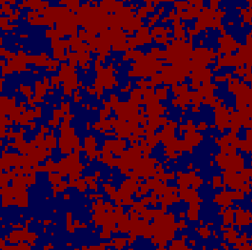

<!-- Improved compatibility of back to top link: See: https://github.com/othneildrew/Best-README-Template/pull/73 -->
<a name="readme-top"></a>
<!--
*** Thanks for checking out the Best-README-Template. If you have a suggestion
*** that would make this better, please fork the repo and create a pull request
*** or simply open an issue with the tag "enhancement".
*** Don't forget to give the project a star!
*** Thanks again! Now go create something AMAZING! :D
-->


<!-- PROJECT SHIELDS -->
<!--
*** I'm using markdown "reference style" links for readability.
*** Reference links are enclosed in brackets [ ] instead of parentheses ( ).
*** See the bottom of this document for the declaration of the reference variables
*** for contributors-url, forks-url, etc. This is an optional, concise syntax you may use.
*** https://www.markdownguide.org/basic-syntax/#reference-style-links
-->


<!-- PROJECT LOGO -->
<br />
<div align="center">
  <a href="https://github.com/Duffy-y/IsingModel">
    
  </a>

<h3 align="center">Ising Model</h3>

  <p align="center">
    A 2D Ising Model simulation using Wolff/Metropolis algorithms in C.
    <br />
    <a href="https://github.com/Duffy-y/IsingModel/issues">Report Bug</a>
    ·
    <a href="https://github.com/Duffy-y/IsingModel/issues">Request Feature</a>
  </p>
</div>


<!-- TABLE OF CONTENTS -->
<h3>Table of content</h3>
  <ol>
    <li>
      <a href="#about-the-project">About The Project</a>
    </li>
    <li>
      <a href="#getting-started">Getting Started</a>
      <ul>
        <li><a href="#prerequisites">Prerequisites</a></li>
        <li><a href="#installation">Installation</a></li>
      </ul>
    </li>
    <li><a href="#license">License</a></li>
  </ol>


<!-- ABOUT THE PROJECT -->
## About The Project

As part of the C Programming teaching unit taught in the third year of a bachelor's degree in the Magister of Fundamental Physics at Paris-Saclay's University, we had to develop and implement a physical system in C as our final project. I chose to take advantage of the speed of C/C++ to study a quite simple system, altough requiring a large number of iterations to reach equilibrium (assuming existence ...). Thus, here is my current project on the 2D Ising model, which could be easily generalized to an n-dimensional Ising model since I've took care of making Wolff Algorithm and Metropolis Algorithm as much agnostic as possible about the dimension of the lattice.


<!-- GETTING STARTED -->
## Getting Started

To run locally the project, we've included a basic Makefile to shorten the compilation process. 

### Prerequisites
- Python C-API
  
1. Change Python C-API include directory in Makefile
   ```
   PYTHON := -I/path -lpython3.12
   ```
   Change `python3.12` to your corresponding python's version.

### Installation

1. Clone directory and cd into it
   ```sh
   git clone https://github.com/Duffy-y/IsingModel. && cd ./IsingModel
   ```

2. Run included Makefile
   ```sh
   make
   ```


<!-- USAGE EXAMPLES -->
## Usage

Use this space to show useful examples of how a project can be used. Additional screenshots, code examples and demos work well in this space. You may also link to more resources.

<!-- LICENSE -->
## License

Distributed under the GNU-GPLv3 License. See `LICENSE` for more information.


<!-- MARKDOWN LINKS & IMAGES -->
<!-- https://www.markdownguide.org/basic-syntax/#reference-style-links -->
[contributors-shield]: https://img.shields.io/github/contributors/Duffy-y/IsingModel.svg?style=for-the-badge
[contributors-url]: https://github.com/Duffy-y/IsingModel/graphs/contributors
[forks-shield]: https://img.shields.io/github/forks/Duffy-y/IsingModel.svg?style=for-the-badge
[forks-url]: https://github.com/Duffy-y/IsingModel/network/members
[stars-shield]: https://img.shields.io/github/stars/Duffy-y/IsingModel.svg?style=for-the-badge
[stars-url]: https://github.com/Duffy-y/IsingModel/stargazers
[issues-shield]: https://img.shields.io/github/issues/Duffy-y/IsingModel.svg?style=for-the-badge
[issues-url]: https://github.com/Duffy-y/IsingModel/issues
[license-shield]: https://img.shields.io/github/license/Duffy-y/IsingModel.svg?style=for-the-badge
[license-url]: https://github.com/Duffy-y/IsingModel/blob/master/LICENSE.txt
[linkedin-shield]: https://img.shields.io/badge/-LinkedIn-black.svg?style=for-the-badge&logo=linkedin&colorB=555
[linkedin-url]: https://linkedin.com/in/linkedin_username
[product-screenshot]: images/screenshot.png
[Next.js]: https://img.shields.io/badge/next.js-000000?style=for-the-badge&logo=nextdotjs&logoColor=white
[Next-url]: https://nextjs.org/
[React.js]: https://img.shields.io/badge/React-20232A?style=for-the-badge&logo=react&logoColor=61DAFB
[React-url]: https://reactjs.org/
[Vue.js]: https://img.shields.io/badge/Vue.js-35495E?style=for-the-badge&logo=vuedotjs&logoColor=4FC08D
[Vue-url]: https://vuejs.org/
[Angular.io]: https://img.shields.io/badge/Angular-DD0031?style=for-the-badge&logo=angular&logoColor=white
[Angular-url]: https://angular.io/
[Svelte.dev]: https://img.shields.io/badge/Svelte-4A4A55?style=for-the-badge&logo=svelte&logoColor=FF3E00
[Svelte-url]: https://svelte.dev/
[Laravel.com]: https://img.shields.io/badge/Laravel-FF2D20?style=for-the-badge&logo=laravel&logoColor=white
[Laravel-url]: https://laravel.com
[Bootstrap.com]: https://img.shields.io/badge/Bootstrap-563D7C?style=for-the-badge&logo=bootstrap&logoColor=white
[Bootstrap-url]: https://getbootstrap.com
[JQuery.com]: https://img.shields.io/badge/jQuery-0769AD?style=for-the-badge&logo=jquery&logoColor=white
[JQuery-url]: https://jquery.com 
